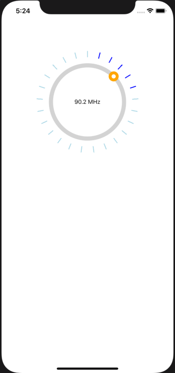

# React Native Radio Trimmer


## Installation
```
yarn add react-native-radio-trimmer
```
or
```
npm install react-native-radio-trimmer
```
## Screenshot

<p align=center>
  
</p>

## Usage

It is necessary to use onMount method, otherwise app will crash

```
import React, { Component } from 'react';
import { SafeAreaView, View, Text } from 'react-native';
import RadioTrimmer from 'react-native-radio-trimmer';


export class ExampleComponent extends Component {
  constructor(props) {
    super(props);
    this.state = {
      textValue: null,
    };
  }
  setValue = value => {
    this.setState({
      textValue: value,
    });
  };

  render() {
    return (
      <SafeAreaView>
        <Header />
        <RadioTrimmer
          boxSize={150}
          marginTop={50}
          onChangeValue={this.setValue}
          onMount={this.setValue}
        >
          <View>
            <Text>{this.state.textValue}</Text>
          </View>
        </RadioTrimmer>
      </SafeAreaView>
    );
  }
}

export default ExampleComponent;
```

## Few trimmers in one row:
```
   <View style={{ flexDirection: 'row' }}>
          <RadioTrimmer
            boxSize={150}
            marginTop={50}
            onChangeValue={this.setValue}
            onMount={this.setValue}
          >
            <View>
              <Text>{this.state.textValue}</Text>
            </View>
          </RadioTrimmer>
          <RadioTrimmer
            boxSize={150}
            marginTop={50}
            onChangeValue={this.setValue}
            onMount={this.setValue}
          >
            <View>
              <Text>{this.state.textValue}</Text>
            </View>
          </RadioTrimmer>

          <RadioTrimmer
            boxSize={150}
            marginTop={50}
            onChangeValue={this.setValue}
            onMount={this.setValue}
          >
            <View>
              <Text>{this.state.textValue}</Text>
            </View>
          </RadioTrimmer>
        </View>

```


### Configuration
##### props:
| Property | Type | Default | Description |
|---------------|----------|-------------|----------------------------------------------------------------|
| accuracy | number | 10 | accuracy of result. 10 will result with 0.1, 0.5, etc |
| backgroundColor | string | transparent | background color of box with Radio Trimmer |
| boxSize | number | 200 | size of box containing the Radio Trimmer |
| dotColor | string | gray | color of radio dot |
| dotIsShadow | boolean | false | makes the dot background blurred|
| dotSize | number | 24 | width and height of the dot |
| innerDotColor | string | white | color of another dot inside the radio dot |
| innerDotSize | number | 10 | default inner dot size  |
| marginTop | number | 0 | margin that allows us to position the box fro top |
| maxValue | number | 108 | maximum scope value |
| minValue | number | 87.5 | minimal scope value |
| onChangeValue | function | null | function that is invoked on every radio text change. it return value of current text. Look at example |
| onMount | function | null | callback function that sets initial value on parent component |
| pathColor | string | lightgray | color of the path under the radio dot |
| pathIsShadow | boolean | false | makes the background of radio trimmer blurred |
| pathWidth | number | 10 | width of the path under the radio dot |
| step | number | 0.1 | value that will be added to each iteriationof calculating text value |
| textAfterNumber | string | MHz | the text that will be added to calculated text value |
| textBackgroundColor | string | transparent | the color under the inside calculated text |
| tickMargin | number | 0 | the distance between radio path and ticks |
| ticksActiveColor | string | black | color of active (hovered) tick  |
| ticksColor | string | gray | color of inactive (unhovered) tick |
| ticksCount | number | 25 | how many ticks will be generated |
| ticksCountHover | number | 5 | how many ticks will be hovered when the radio dot is near |
| ticksLength | number | 15 | the height of single tick |
| ticksWidth | number | 2 | the width of single tick  |

##### onChangeValue, onMount:
```
  setValue = value => {
    this.setState({
      textValue: value,
    });
  };

<RadioTrimmer
          boxSize={150}
          marginTop={50}
          onChangeValue={this.setValue}
          onMount={this.setValue}
        >
```


